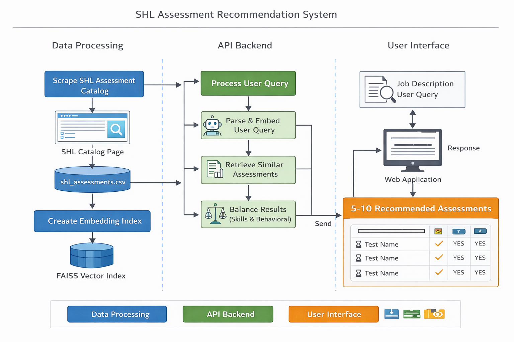

# SHL Assessment Recommendation System

An end-to-end **Assessment Recommendation System** built as part of the SHL AI Intern assignment.  
The system recommends relevant **SHL Individual Test Solutions** based on recruiter queries or job descriptions.

The project includes:
- A vector-based recommendation engine
- A FastAPI backend
- A Streamlit frontend
- Evaluation using Recall@K
- Fully deployed, live system

---

## 🚀 Live Demo

### 🔹 Frontend (Streamlit)
👉 https://shl-assessment-recommendation-system-noux4kphg2xa4g2zbdrxuk.streamlit.app/

### 🔹 Backend API (FastAPI – Render)
- Health Check:  
  👉 https://shl-assessment-recommendation-system-1-wcau.onrender.com/health
- Recommendation Endpoint:  
  👉 https://shl-assessment-recommendation-system-1-wcau.onrender.com/recommend

---

## 🧠 Problem Statement

Given a natural language hiring query or job description, recommend **up to 10 relevant SHL assessments** that best match:
- Technical skill requirements
- Behavioral and personality traits
- Hiring constraints

This is a **multi-label recommendation problem**, as each query may map to multiple valid assessments.

---

## 🏗️ System Architecture

The following diagram illustrates the end-to-end architecture of the SHL Assessment Recommendation System, covering data processing, backend API flow, and user interface.



User (Browser)
|
v
Streamlit Frontend (UI)
|
v
FastAPI Backend (Render)
|
v
TF-IDF Vector Recommender
|
v
SHL Assessment Catalog (CSV)


---

## ⚙️ Technology Stack

- **Backend**: FastAPI
- **Frontend**: Streamlit
- **ML / NLP**: TF-IDF + Cosine Similarity
- **Evaluation**: Recall@10
- **Deployment**:
  - Backend: Render
  - Frontend: Streamlit Cloud
- **Language**: Python 3.10

---

## 🔍 Recommendation Approach

### 1. Text Representation
Each SHL assessment is represented using:
- Assessment name
- Description
- Test type (Knowledge / Personality)

TF-IDF vectorization is applied to convert text into numerical vectors.

---

### 2. Similarity Search
- Recruiter query is vectorized using the same TF-IDF model
- Cosine similarity is computed against all assessments
- Top-K most similar assessments are retrieved

---

### 3. Domain-Aware Re-ranking
If a query contains both:
- Technical signals (e.g., Java, Python, SQL)
- Behavioral signals (e.g., collaboration, leadership)

The system balances recommendations between:
- Knowledge/Skill tests
- Personality/Behavior tests

---

## 📊 Evaluation

- Metric: **Mean Recall@10**
- Dataset: SHL-provided labeled train set
- URL normalization is applied during evaluation to avoid formatting mismatches

### Observation:
The TF-IDF baseline achieves a low Recall@10 due to:
- Long and generic job descriptions
- Strict URL-level matching
- Lexical (non-semantic) retrieval limitations

These results highlight the need for semantic embeddings in future iterations.

---

## 📁 Project Structure

shl-assessment-recommendation-system/
│
├── backend/
│ ├── api/
│ │ └── app.py
│ └── core/
│ └── recommender.py
│
├── frontend/
│ └── app.py
│
├── experiments/
│ ├── evaluate.py
│ └── generate_submission.py
│
├── data/
│ ├── processed/
│ └── evaluation/
│
├── docs/
│ └── approach.md
│
├── requirements.txt
├── runtime.txt
└── README.md


---

## ▶️ Running Locally

### 1️⃣ Install dependencies
```bash
pip install -r requirements.txt

2️⃣ Start backend
uvicorn backend.api.app:app --reload

3️⃣ Start frontend
streamlit run frontend/app.py
